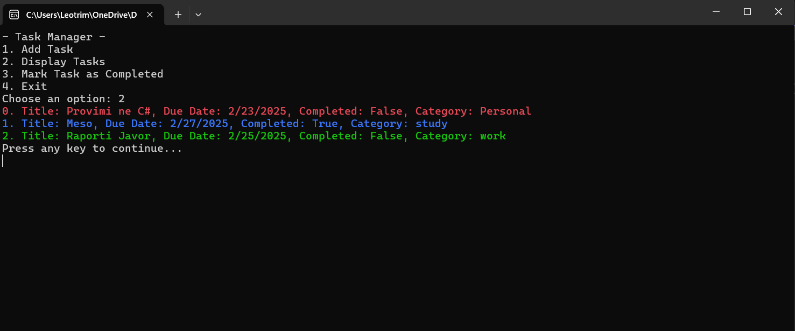

## Programming-Exam-TaskManager

### Clone the repository:

   git clone https://github.com/LeotrimIslami/Programming-Exam-TaskManager.git  
   cd Programming-Exam-TaskManager/TaskManager
   
 ## 📌 Usage
🔧 ***Build and Run the Application***  
 1️⃣ **Open the Project in Visual Studio**  
 Launch Visual Studio and open the solution (.sln file).  
 2️⃣ **Build the Project**  
 Ensure there are no errors before running.  
 3️⃣ **Run the Application**  
 Press F5 to run with debugging or Ctrl + F5 to run without debugging.  
 The console will open, showing the Task Manager menu.  

### Use the menu options:
> ✅ **Add Task**: Follow prompts to create a new task  
> ✅ **List Tasks**: View all tasks with colored categories  
> ✅ **Mark Complete**: Update task status by index  
> ✅ **Exit**: Save changes and quit  
- *Data is automatically saved to tasks.txt when exiting*
- 📂 File Storage  
Tasks are automatically saved to ***tasks.txt*** in the project folder.  
*If the file doesn't exist, it will be created when you exit the program*.

### Screenshot se si do te duket aplikacioni *TaskManager* ne Console

### Mesova
> ✅ Krijimi i nje aplikacioni te menaxhimit te taskeve  
> ✅ Implementimi i funksionalitetit si shtimi, shfaqja dhe perfundimi i taskeve

### Sfidat
> 1️⃣ Zgjidhja e gabimeve dhe funksioneve të aplikacionit.  
> 2️⃣ Ruajtja e te dhenave ne file *Task.txt* pas mbylljes se programit
